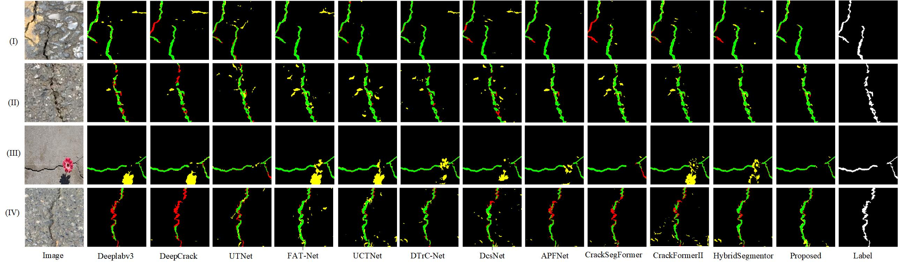
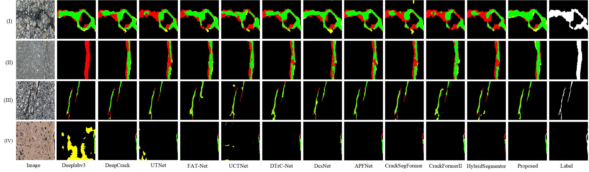
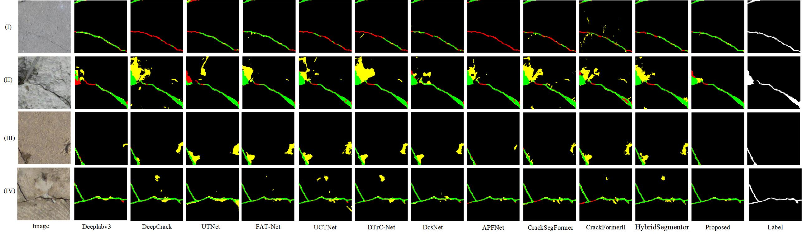

# CCBG-Net

> Cross-Layer Context Boundary Guided Network for Concrete Crack Segmentation
>
> **Note**: The paper is currently under submission. Once the paper is accepted, the training code will be made available as open-source. Stay tuned for updates! 
>
> ##  Download Datasets and Pretrained Models

Download datasets and model weights from Baidu Cloud Disk:

🔗**Link**:  https://pan.baidu.com/s/1_0UjyPPRgq_usnffdiyQnQ?pwd=SD7Y 提取码: SD7Y


---

## ☁️️ Run Test

Use the following commands to test different datasets:


### 🔹 DeepCrack

```bash
python test.py --dataset_root ./dataset/DeepCrack
```

### 🔹 Crack500

```bash
python test.py --dataset_root ./dataset/Crack500
```

### 🔹 Crack760

```bash
python test.py --dataset_root ./dataset/Crack760
```

## 📸 Qualitative Results

### 🔹 **Results on DeepCrack Challenge Testing Images**



### 🔹 **Results on Crack500 Challenge Testing Images**



### 🔹 **Results on Crack760 Challenge Testing Images**



